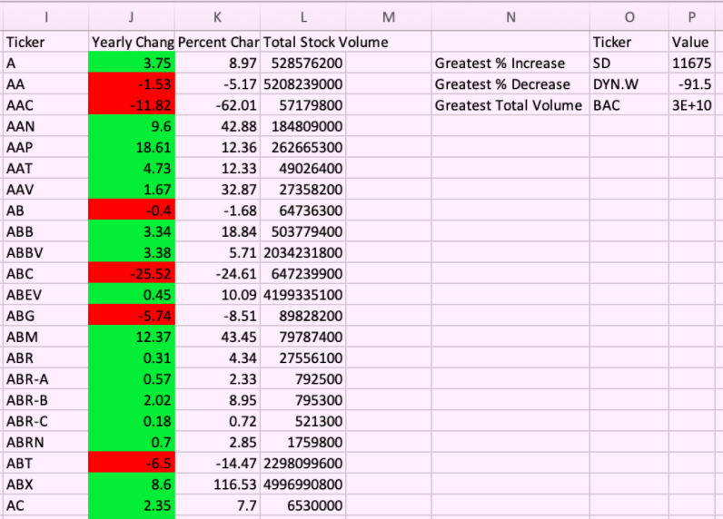

### Problem this analysis is trying to solve:
Stocks are constantly changing every day, generating an enormous amount of data. The purpose of this analysis is to combine all the data of each stock each year so you can clearly see the bigger picture of how well a stock did for a particular year.

### How to view and run the code:
Open up file in Excel. Once in Excel, go to VBA using the ribbon/tabs at the top. Press play in VBA. All 3 worksheets in the Excel file will then populate with the data.

### Data Collected:

### Why the data is displayed this way:
Each data set pictured above illustrates data from stocks from 2014, 2015, and 2016, respectively. Each set of tickers was merged into one row. The opening amount of the first ticker of each set was subtracted from the closing amount of the last ticker of each set to find the yearly change. If the yearly change was positive, it was colored green, and if it was negative, it was colored red. Based on the yearly change, the percent change was then calculated. The total stock volume was calculated by adding the stock volume of each ticker in each set together. Based on all of the tickers, the greatest percent increase, greatest percent decrease, and greatest total volume was determined.
